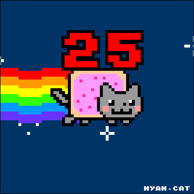

 
  
   

  <h3><b>Welcome to this Repository :)</b></h3>

# 📗 Table of Contents

- [📖 About the Project](#about-project)
  - [🛠 Built With](#built-with)
    - [Tech Stack](#tech-stack)
    - [Key Features](#key-features)
  - [🚀 Live Demo](#live-demo)
- [💻 Getting Started](#getting-started)
  - [Prerequisites](#prerequisites)
  - [Setup](#setup)
  - [Install](#install)
  - [Usage](#usage)
  - [Run tests](#run-tests)
  - [Deployment](#deployment)
- [👥 Authors](#authors)
- [🔭 Future Features](#future-features)
- [🤝 Contributing](#contributing)
- [⭐️ Show your support](#support)
- [🙏 Acknowledgements](#acknowledgements)
- [📝 License](#license)

# 📖 Awsome Books With React 

**Awsome Books With React** is a... Describe your project in 1 or 2 sentences.

## 🛠 Built With 

### Tech Stack 

  
Client

  <ul>
    <li><a href="https://reactjs.org/">React.js</a></li>
  </ul>

### Key Features 

<!-- > Describe between 1-3 key features of the application. -->

- **[Use Create React APP]**
- **[Use React Routes]**
- **[Use React Redux]**

(<a href="#readme-top">back to top</a>)

## 🚀 Live Demo 

Coming soon...
<!-- - [Live Demo Link](https://google.com) -->

(<a href="#readme-top">back to top</a>)

## 💻 Getting Started 

To get a local copy up and running, follow these steps.

### Prerequisites

In order to run this project you need :
Install this:
Node js
Visual Studio Code
Git

### Setup

Clone this repository to your desired folder:
and a open a new terminal on your visual studio code

  

### Install

Install this project with:
npm install

### Usage

To run the project, execute the following command:
npm run start

### Run tests

To run tests, run the following command:
npm run test

### Deployment

You can deploy this project using:
you can use any service avalaible on internet such as:

Render
Heroku

I recomend Render since is easy to use

(<a href="#readme-top">back to top</a>)

## 👥 Authors 

> Mention all of the collaborators of this project.

👤 **Mariano Benjamin**

- GitHub: [@githubhandle](https://github.com/benja27)
- LinkedIn: [LinkedIn](http://www.linkedin.com/in/BenjaMendez2699)

(<a href="#readme-top">back to top</a>)

## 🔭 Future Features 

- [ ] **[Improve user interface]**
- [ ] **[Improve Js code]**
- [ ] **[Implement conexion to a database]**

(<a href="#readme-top">back to top</a>)

## 🤠Contributing 

Contributions, issues, and feature requests are welcome!

Feel free to check the [issues page](../../issues/).

(<a href="#readme-top">back to top</a>)

## ⭐️ Show your support 

If you like this project please give me star! thanks!

(<a href="#readme-top">back to top</a>)

## 🙠Acknowledgments 

I would like to thank microverse for this great coding experience

(<a href="#readme-top">back to top</a>)

(<a href="#readme-top">back to top</a>)

## 📠License 

This project is [MIT](./MIT.md) licensed.

(<a href="#readme-top">back to top</a>)

